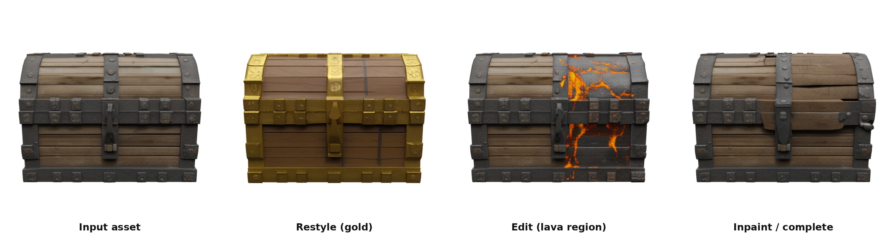

# SLAT-Studio



Downstream 3D tasks built on [Microsoft TRELLIS](https://github.com/microsoft/TRELLIS) and its
**Structured LATent (SLAT)** representation.

Where TRELLIS goes text/image → 3D, SLAT-Studio takes an **existing 3D asset + a text prompt** and
edits it in SLAT space — generate, restyle, region-edit, morph, and inpaint. TRELLIS is vendored
**unmodified** as a submodule under `third_party/TRELLIS`; all new logic lives in `slat_studio` and
only *imports* `trellis.*` (custom sampling is done by subclassing).

## Setup

We reuse TRELLIS's CUDA environment. Build it once into a conda env named `trellis`, matching
`CUDA_HOME` to the env's pinned `pytorch-cuda=11.8`:

```bash
git clone --recurse-submodules git@github.com:Sytwu/SLAT-Studio.git && cd SLAT-Studio
export CUDA_HOME=/usr/local/cuda-11.8
export PATH="$CUDA_HOME/bin:$PATH"
cd third_party/TRELLIS
. ./setup.sh --new-env --basic --xformers --flash-attn \
    --diffoctreerast --spconv --mipgaussian --kaolin --nvdiffrast
```

Requires Linux + an NVIDIA GPU (16 GB+ VRAM), a CUDA toolkit, and conda. See
[docs/ENVIRONMENT.md](docs/ENVIRONMENT.md) for the verified host config and known gotchas.

## Run the Gradio app

The script sets `PYTHONPATH`/CUDA env and launches all tabs (Generate, Restyle, Edit, Morph,
Inpaint, Bridge) on [http://localhost:7860](http://localhost:7860):

```bash
bash scripts/run_app.sh
```

The pipeline loads lazily on first use, so the UI comes up immediately. Gradio does **not**
hot-reload — restart the script to pick up code edits.
